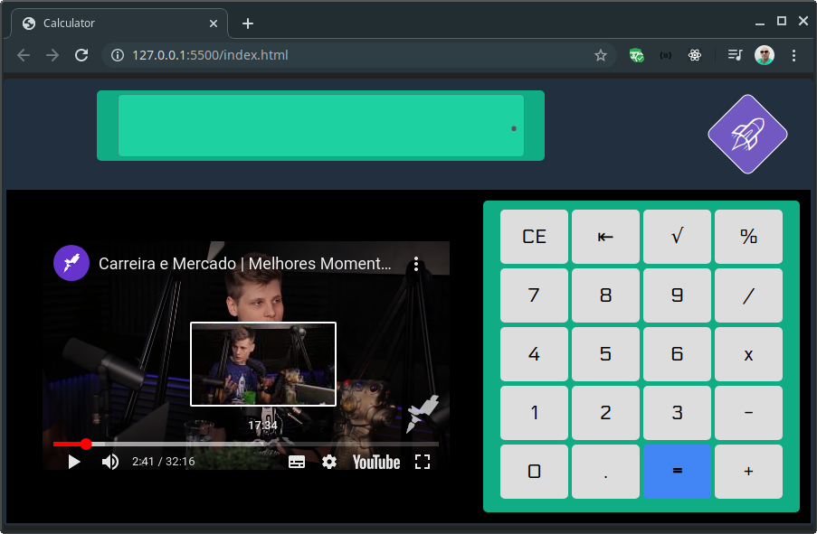

# crazy-calculator

## Calculadora desenvolvida em HTML, CSS, JavaScript
Para executar, basta baixar e abrir o arquivo `index.html`

Para editar, basta editar os arquivos usando qualquer editor de texto. 